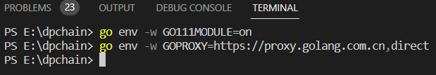

# install support of go_win_version dpchain 
# install vscode
# install golang1.18
[go_download_link](https://go.dev/dl/)  
**download go1.18 version!!**
# install go package
if you located in China,vscode auto install is unavailable.follow down step.  
enter follow commend in vscode 
 ```
 go env -w GOPROXY=https://proxy.golang.com.cn,direct
 go env -w GO111MODULE=on
 ```
  
then you can install go package in vscode auto install.
# install cgo
[follow this](https://blog.csdn.net/u011965468/article/details/127934638)  
