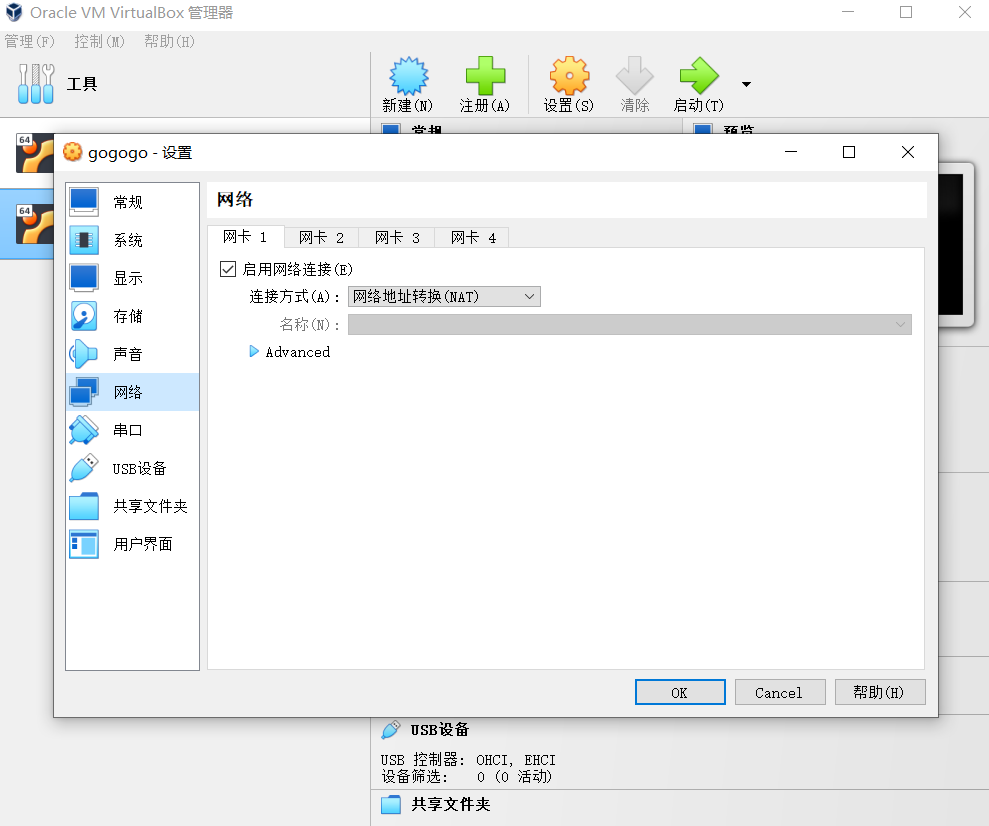
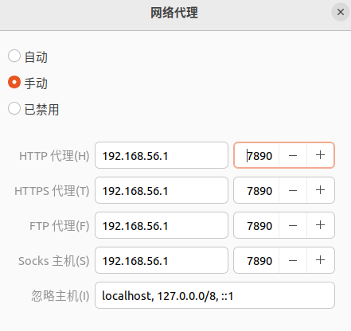

# introduce
if you located in china. vpn is necessary. this tutorial will help you use vpn in Linux virtual machine and don`t need install additional software in your linux virtual machine, instand to use vpn on your Windows home machine. 
# 1. check your vpn proxy server ip and port
able vpn local area network mode
# 2. set you virtual machine Network connncet method in NAT mode
for example

# 3. open virtual machine and set the porxy server ip and port 
for example  

# 4. have fun :)